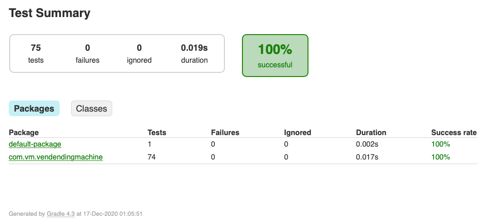
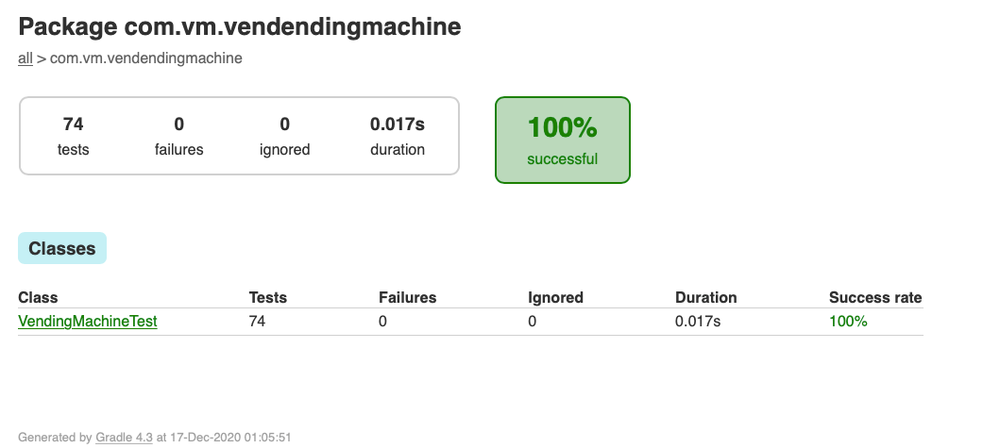
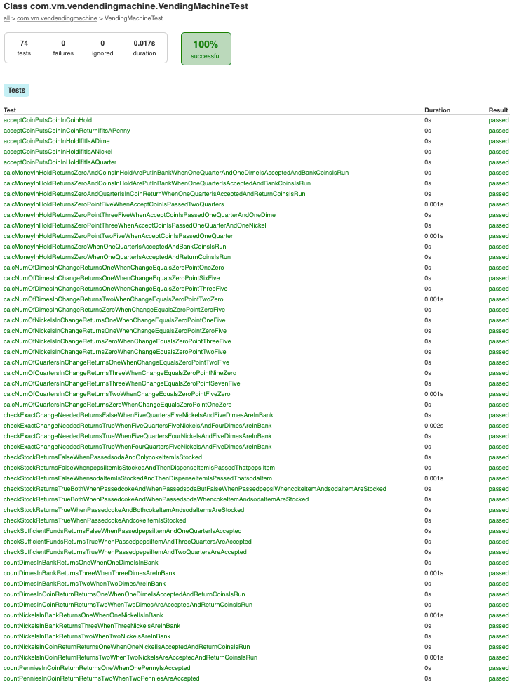

# Vending Machine
This is a test program to simulate Vending Machine application.

|                  |                           |
| ---------------- | -------------------------:|
| Code:            |                    Java   |
| Build:           |              Gradle 4.2.1 |
| Test coverage:   |                     JUnit |
| IDE:             |              Intellij IDE |

To build:

    $ ./gradlew build

The following scenarios are implemented as part of the test application :
1.    Accept coins of 1,5,10,25 Cents i.e. penny, nickel, dime, and quarter.
2.    Allow user to select products Coke(25), Pepsi(35), Soda(45)
3.    Allow user to take refund by cancelling the request.
4.    Return selected product and remaining change if any.
5.    Allow reset operation for vending machine supplier.

To Test :

    $ ./gradlew test -info

Gradle test will run all the junit test cases.

Junit Test reports can be accessed from the following folder :

    'build/reports/tests/test/index.html'

Sample Junit test reports : 

